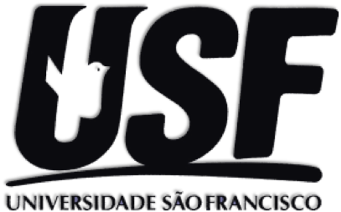

# Produção de Textos I

{width="296"}

Site da disciplina Produção de Textos da pós graduação em Psicologia da Universidade São Francisco

## Objetivos
* Desenvolver competências e conhecimentos basais necessários à elaboração e análise crítica de artigos científicos  
* Desenvolver competências de redação de artigos  
* Desenvolver o raciocínio crítico em relação aos métodos de pesquisa em ciências humanas aplicados à produção de conhecimento  
* Estimular a criatividade, o estudo, o domínio de conceitos de metodologia e psicometria por intermédio de discussões de projetos e artigos de pesquisa.  
* Produzir um artigo  

## Programa

* Estrutura dos artigos científicos e normas da APA  
* Escrita científica  
* Desenho de pesquisa e análise de dados  
* Bases de dados de revistas, medidas de impacto e revisão bibliográfica  

## Atividades 

* Atividade 1: Problema 
* Atividade 2: Introdução
* Atividade 3: Método e Resultados
* Atividade 4: Discussão

## Cronograma
